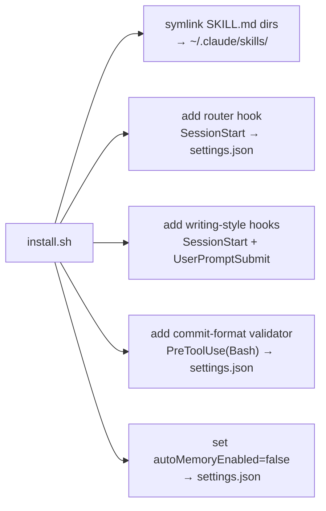
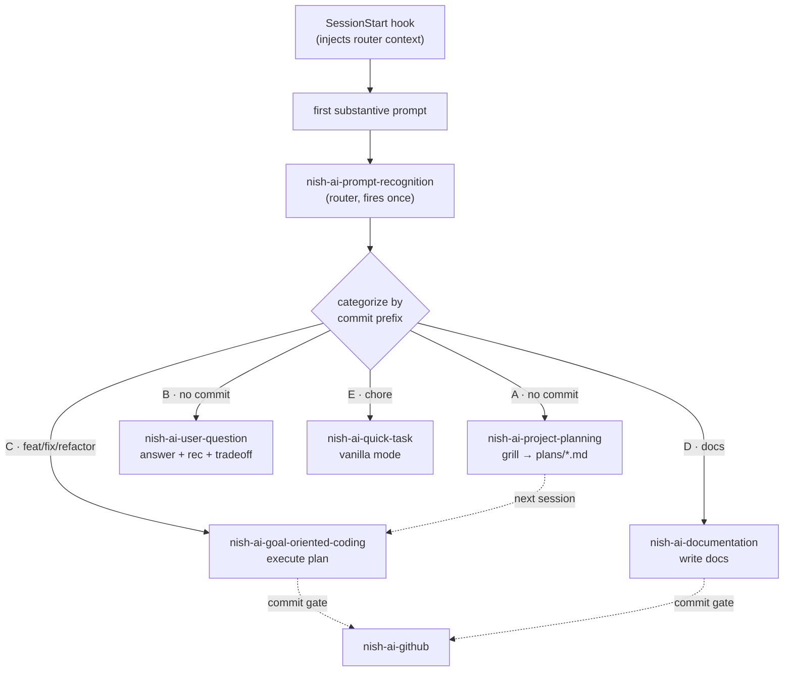
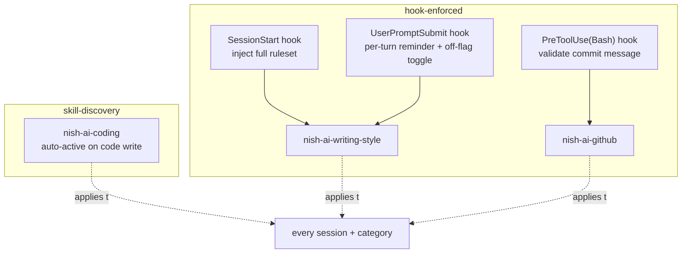

# Nish AI Skills

Claude Code skills for personal workflow. Auto-active via SessionStart hook.

## Install

```
git clone https://github.com/ubunish/nish-ai.git ~/nish-ai
cd ~/nish-ai && ./install.sh
```

Symlinks skills into `~/.claude/skills/`, adds SessionStart hook to `~/.claude/settings.json`, and sets `autoMemoryEnabled: false` to disable auto-memory. Requires `jq` (`brew install jq`).

## Commands

| Command | Action |
|---------|--------|
| `./install.sh` | Link skills + add hook (idempotent) |
| `./install.sh uninstall` | Remove symlinks + hook |
| `./install.sh status` | Show what's linked |

## Skills

| Skill | Purpose |
|-------|---------|
| `nish-ai-writing-style` | Auto-active prose style |
| `nish-ai-github` | Commit + branch + PR conventions |
| `nish-ai-prompt-recognition` | Session router (fires once) |
| `nish-ai-coding` | Auto-active coding principles |
| `nish-ai-project-planning` | Grill-me planner → `plans/*.md` |
| `nish-ai-user-question` | Answer + recommendation + tradeoff |
| `nish-ai-goal-oriented-coding` | Plan execution workflow |
| `nish-ai-documentation` | Docs writer |
| `nish-ai-quick-task` | Vanilla Claude mode |

## Architecture

Two layers: install-time wiring (one-off) and per-session runtime (every session).

### Install Wiring

`install.sh` mutates the Claude Code environment, idempotent and reversible.



| Action | Effect |
|--------|--------|
| Symlink | Each skill dir linked into `~/.claude/skills/`, so Claude discovers them |
| Router hook | SessionStart injects context telling Claude to run the router on first prompt |
| Style hooks | SessionStart injects full ruleset; UserPromptSubmit re-injects a reminder each turn |
| Commit validator | PreToolUse(Bash) blocks a `git commit` that breaks nish-ai-github format |
| Auto-memory off | Disables built-in auto-memory; this system owns workflow state |

All hooks are idempotent; `uninstall` and `status` cover every hook above.

### Runtime Dispatch

Every session: hook arms the router, router fires once on the first substantive prompt, dispatches to one category skill that owns the rest of the session.



### Always-On Layer

Three skills run across every category, not dispatched by the router. They differ by mechanism.



| Skill | Mechanism | Triggers on | Off switch |
|-------|-----------|-------------|------------|
| `nish-ai-writing-style` | Hooks (SessionStart + UserPromptSubmit) | Every session + every turn | "drop style" / "verbose mode" → off-flag; "resume style" → on |
| `nish-ai-coding` | Skill discovery | Any source-code write or edit | "drop coding style" |
| `nish-ai-github` | PreToolUse(Bash) validator + explicit invoke | Every `git commit`; commit / branch / PR boundary | validator denies malformed commits, not user-toggleable |

Off-flag lives at `~/.claude/.nish-style-off`. Present → both style hooks no-op. Toggled by phrase, persists across turns.

### Categories

| ID | First prompt is… | Commit prefix | Skill |
|----|------------------|---------------|-------|
| A | Draft a plan | none | `nish-ai-project-planning` |
| B | A question, no code change | none | `nish-ai-user-question` |
| C | Build / fix / refactor | `feat`/`fix`/`refactor` | `nish-ai-goal-oriented-coding` |
| D | Write / restructure docs | `docs` | `nish-ai-documentation` |
| E | Light housekeeping | `chore` | `nish-ai-quick-task` |

Router picks the narrowest fit, one category per session. Re-categorizes only if the user's intent visibly pivots.
