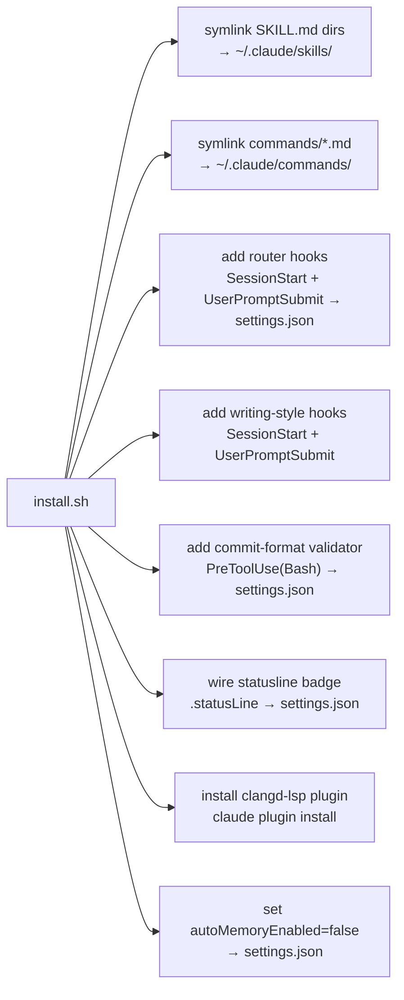
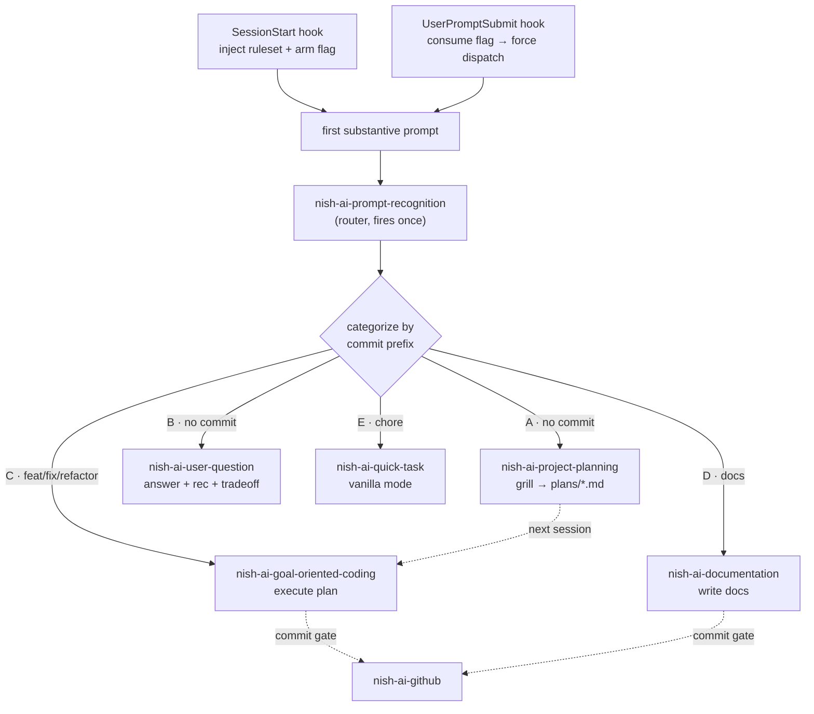
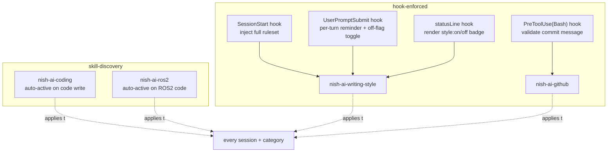

# Nish AI Skills

Claude Code skills for personal workflow. Auto-active via SessionStart hook.

## Install

```
git clone https://github.com/ubunish/nish-ai.git ~/nish-ai
cd ~/nish-ai && ./install.sh
```

Symlinks skills into `~/.claude/skills/`, slash commands into `~/.claude/commands/`, adds the router, writing-style, and commit-validator hooks to `~/.claude/settings.json`, wires the writing-style statusline badge, installs the `clangd-lsp` code-intelligence plugin, and sets `autoMemoryEnabled: false` to disable auto-memory. Requires `jq` (`brew install jq`); the plugin step also needs the `claude` CLI.

## Commands

| Command | Action |
|---------|--------|
| `./install.sh` | Link skills + add hook (idempotent) |
| `./install.sh uninstall` | Remove symlinks + hook |
| `./install.sh status` | Show what's linked |
| `./tests/run.sh` | Run the commit-hook test suite (no bats; needs `jq` + `perl`) |

## Skills

| Skill | Purpose |
|-------|---------|
| `nish-ai-writing-style` | Auto-active prose style, two modes by surface (TERMINAL / DOCS) |
| `nish-ai-github` | Commit + branch + PR conventions |
| `nish-ai-prompt-recognition` | Session router (fires once) |
| `nish-ai-coding` | Auto-active coding principles |
| `nish-ai-project-planning` | Grill-me planner → `plans/*.md` |
| `nish-ai-user-question` | Answer + recommendation + tradeoff |
| `nish-ai-goal-oriented-coding` | Plan execution workflow |
| `nish-ai-documentation` | Docs writer |
| `nish-ai-quick-task` | Vanilla Claude mode |
| `nish-ai-ros2` | Auto-active ROS2 best practices (rides the always-on tier) |

## Slash Commands

Symlinked into `~/.claude/commands/` by `install.sh`.

| Command | Action |
|---------|--------|
| `/merge` | Merge the current branch into `main` without a PR, push, and delete the branch (local + remote) |

## Tests

`tests/run.sh` covers the two fragile commit hooks with plain bash assertions — no bats, so it runs anywhere the hooks run. It exercises `validate-commit.sh` (pass / rewrite / deny decisions) and `rewrite-commit.pl` (body and trailer collapse, prefix and tail preservation, bail cases). Needs `jq` and `perl`.

```
./tests/run.sh
```

## Repo Layout

```
nish-ai/
├── install.sh                  link skills + commands, wire hooks
├── commands/                   slash commands → ~/.claude/commands/
│   └── merge.md
├── tests/                       commit-hook test suite (run.sh)
├── nish-ai-writing-style/      always-on prose style (+ hooks/)
├── nish-ai-github/             commit/branch/PR conventions (+ hooks/)
├── nish-ai-prompt-recognition/ session router (+ hooks/)
└── nish-ai-categories/         skills dispatched by the router
    ├── nish-ai-coding/
    ├── nish-ai-project-planning/
    ├── nish-ai-user-question/
    ├── nish-ai-goal-oriented-coding/
    ├── nish-ai-documentation/
    ├── nish-ai-quick-task/
    └── nish-ai-ros2/
```

`install.sh` finds every `SKILL.md` by `find`, so the `nish-ai-categories/` grouping is for repo organization only — skills link into `~/.claude/skills/` by basename, flat.

## Architecture

Two layers: install-time wiring (one-off) and per-session runtime (every session).

### Install Wiring

`install.sh` mutates the Claude Code environment, idempotent and reversible.



| Action | Effect |
|--------|--------|
| Symlink | Each skill dir linked into `~/.claude/skills/`, and each `commands/*.md` into `~/.claude/commands/`, so Claude discovers them |
| Router hooks | Hard dispatch, not a soft pointer. SessionStart injects the full router ruleset and arms a once-per-session flag; UserPromptSubmit consumes the flag on the first prompt to force categorize + dispatch. Mirrors the writing-style two-hook pattern |
| Style hooks | SessionStart injects full ruleset; UserPromptSubmit re-injects a reminder each turn |
| Commit validator | PreToolUse(Bash) auto-rewrites a `git commit` carrying a body or `Co-Authored-By` trailer down to subject-only, preserving both a `git add … &&` prefix and a chained tail (`&& git log`, `&& git push`); denies only what it cannot safely fix (bad prefix, capitalized subject, trailing period) or cannot safely collapse (a second `git commit` in the tail, or a trailer that would survive in the tail) |
| Statusline badge | Sets `.statusLine` to render the `✎ style:on`/`off` + category badge, only when no status line is set yet; a custom `.statusLine` is left untouched |
| Plugin install | Installs the `clangd-lsp` code-intelligence plugin via the `claude plugin` CLI (marketplace `anthropics/claude-plugins-official`), idempotent; skipped if the `claude` CLI is absent |
| Auto-memory off | Disables built-in auto-memory; this system owns workflow state |

All hooks are idempotent; `uninstall` and `status` cover every hook above.

### Runtime Dispatch

Every session: SessionStart arms the router and loads its ruleset, the first prompt consumes the flag and forces dispatch, the chosen category skill owns the rest of the session.



### Always-On Layer

Four skills run across every category, not dispatched by the router. They differ by mechanism.



| Skill | Mechanism | Triggers on | Off switch |
|-------|-----------|-------------|------------|
| `nish-ai-writing-style` | Hooks (SessionStart + UserPromptSubmit + statusLine badge) | Every session + every turn | "drop style" / "verbose mode" → off-flag; "resume style" → on |
| `nish-ai-coding` | Skill discovery | Any source-code write or edit | "drop coding style" |
| `nish-ai-ros2` | Skill discovery | ROS2 signals: `package.xml` (ament), `rclpy`/`rclcpp`, `.msg`/`.srv`/`.action`, `launch/`/`config/` | "drop ros2" |
| `nish-ai-github` | PreToolUse(Bash) validator + explicit invoke | Every `git commit`; commit / branch / PR boundary | validator auto-fixes or denies malformed commits, not user-toggleable |

Beyond auto-activation, `nish-ai-ros2` folds into three category skills at their boundaries: `nish-ai-coding` enforces its thirty practices at the commit gate, `nish-ai-project-planning` folds its architectural decisions (node split, custom-interface packages, services-vs-actions) into the plan, and `nish-ai-documentation` applies its per-package README structure. Off on "drop ros2".

Off-flag lives at `~/.claude/.nish-style-off`. Present → both style hooks no-op. Toggled by phrase, persists across turns. The `statusLine` hook (`style-statusline.sh`) reads the same flag and renders a `✎ style:on` / `✎ style:off` badge so the active state is visible. `install.sh` wires it into the `statusLine` setting, but only when no status line is set yet — a custom `.statusLine` is left untouched.

#### Writing-Style Modes

`nish-ai-writing-style` picks one of two modes per response, chosen by output surface:

| Mode | Surface | Rule |
|------|---------|------|
| `TERMINAL` | Chat replies, explanations Nish reads (ephemeral) | Unconditional caveman — never use a/an/the, drop and/but/so, cut filler, fragments OK. No per-sentence judgement, so no drift. |
| `DOCS` | Committed artifacts others read (docs, README, code comments, PR/commit messages) | Readable-terse — keep articles and full sentences, still cut filler. Stays professional for a cold reader. |

```
chat / explanations          → TERMINAL
docs / README / comments     → DOCS
PR / commit messages         → DOCS
security / destructive / "explain more"  → exempt, full prose
```

Both modes share: state idea once, simple word over complex, diagram over text, Title Case headings, sentence case body.

### Categories

| ID | First prompt is… | Commit prefix | Skill |
|----|------------------|---------------|-------|
| A | Draft a plan | none | `nish-ai-project-planning` |
| B | A question, no code change | none | `nish-ai-user-question` |
| C | Build / fix / refactor | `feat`/`fix`/`refactor` | `nish-ai-goal-oriented-coding` |
| D | Write / restructure docs | `docs` | `nish-ai-documentation` |
| E | Light housekeeping | `chore` | `nish-ai-quick-task` |

Router picks the narrowest fit, one category per session. Re-categorizes only if the user's intent visibly pivots.
