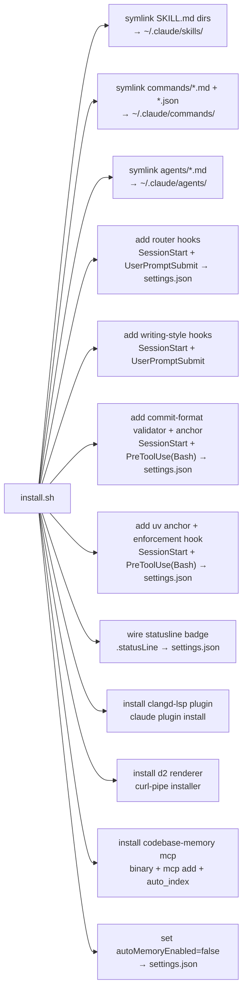
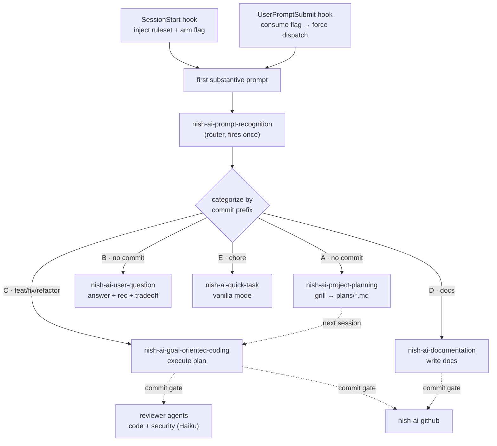
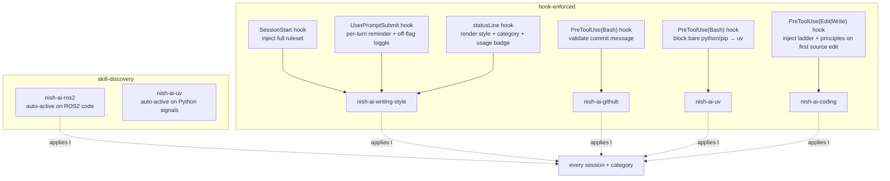
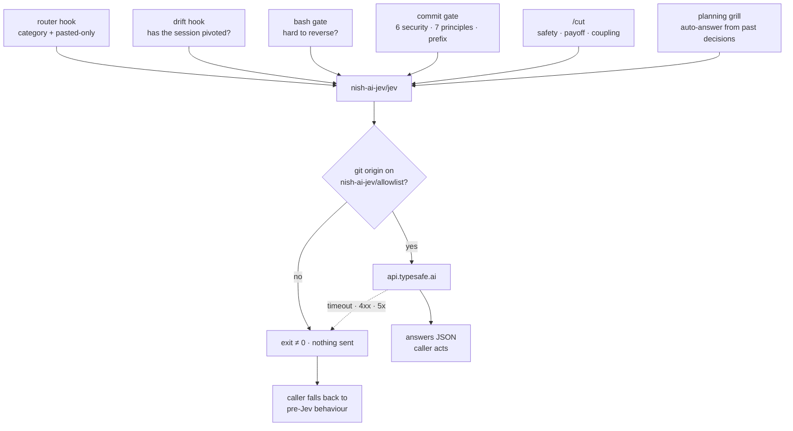

# Nish AI Skills

Claude Code skills for personal workflow. Auto-active via SessionStart hook.

## Install

```
git clone https://github.com/ubunish/nish-ai.git ~/nish-ai
cd ~/nish-ai && ./install.sh
```

Symlinks skills into `~/.claude/skills/`, slash commands into `~/.claude/commands/`, reviewer agents into `~/.claude/agents/`, adds the router, writing-style, commit-validator, and uv-enforcement hooks to `~/.claude/settings.json`, wires the writing-style statusline badge, installs the `clangd-lsp` code-intelligence plugin, provisions the d2 diagram renderer (see [Skills](#skills)), installs and registers the codebase-memory MCP server (see [Memory](#memory)), sets `autoMemoryEnabled: false` to disable auto-memory, and merges a set of permission rules into `.permissions` so common safe tools stop prompting. Requires `jq` (`brew install jq`); the plugin and memory steps also need the `claude` CLI; the d2 step needs `curl`.

Two diagram renderers, split by skill. `nish-ai-project-planning` and `nish-ai-writing-style` render mermaid to static images with the Mermaid CLI (`mmdc`) when it is on `PATH`, and fall back to raw mermaid blocks otherwise — mermaid-cli is optional and managed by nish-setup (`brew install mermaid-cli`). `nish-ai-documentation` renders diagrams with terrastruct's d2 instead, backed by the `nish-ai-d2` authoring skill; `install.sh` provisions the d2 binary system-wide via the upstream installer.

## Commands

| Command | Action |
|---------|--------|
| `./install.sh` | Link skills + add hook (idempotent) |
| `./install.sh uninstall` | Remove symlinks + hook |
| `./install.sh status` | Show what's linked |
| `./tests/run.sh` | Run the commit-hook test suite (no bats; needs `jq` + `perl`) |
| `./tests/uv.sh` | Run the uv-hook test suite (no bats; needs `jq`) |
| `./tests/agents.sh` | Run the reviewer-agent test suite (no bats; needs `jq`) |
| `./tests/statusline.sh` | Run the statusline-badge test suite (no bats; needs `jq`) |
| `./tests/session-id.sh` | Run the flag-path safety test suite (no bats; needs `jq`) |
| `./tests/style-toggle.sh` | Run the writing-style toggle test suite (no bats; needs `jq`) |
| `./tests/jev.sh` | Run the jev CLI + replay test suite (no bats; needs `jq` + `uv`) |
| `./tests/router.sh` | Run the router/drift judgment test suite (no bats; needs `jq` + `uv`) |
| `./tests/bash-gate.sh` | Run the bash-gate test suite (no bats; needs `jq` + `uv`) |

## Skills

| Skill | Purpose |
|-------|---------|
| `nish-ai-writing-style` | Auto-active prose style, two modes by surface (TERMINAL / DOCS) |
| `nish-ai-github` | Commit + branch + PR conventions |
| `nish-ai-prompt-recognition` | Session router (fires once) |
| `nish-ai-coding` | Coding principles + build ladder (dispatch + first-edit anchor) |
| `nish-ai-project-planning` | Grill-me planner → `plans/*.md` |
| `nish-ai-user-question` | Answer + recommendation + tradeoff |
| `nish-ai-goal-oriented-coding` | Plan execution workflow |
| `nish-ai-documentation` | Docs writer |
| `nish-ai-quick-task` | Vanilla Claude mode |
| `nish-ai-ros2` | Auto-active ROS2 best practices (rides the always-on tier) |
| `nish-ai-uv` | Auto-active "prefer uv" convention + SessionStart anchor + PreToolUse enforcement hook |
| `nish-ai-d2` | d2 diagram authoring reference, loaded by name by `nish-ai-documentation` |
| `nish-ai-jev` | Typed judgments for hooks and gates via TypeSafe's Jev, loaded by name |

## Slash Commands

Symlinked into `~/.claude/commands/` by `install.sh`.

| Command | Action |
|---------|--------|
| `/merge` | Merge the current branch into `main` without a PR, push, and delete the branch (local + remote) |
| `/cut` | Audit the whole repository for deletable code — spawns the code reviewer in repo mode for a deletion-only pass, then re-ranks the candidates with Jev on safety, payoff and coupling |

## Agents

Fresh-context reviewer subagents, symlinked into `~/.claude/agents/` by `install.sh`. Spawned by `nish-ai-goal-oriented-coding` at the commit gate — a reviewer with no attachment to how the code was written catches residue the writer's own context hides. Both run on Haiku, read-only, and return severity-tagged findings: `high` blocks the commit, `low` surfaces as a note. Each finding is then checked back against the hunk it names, and one the code does not support is tagged `unverified` rather than dropped.

| Agent | Lens | Spawns |
|-------|------|--------|
| `nish-ai-code-reviewer` | The seven `nish-ai-coding` principles | Every commit, unless the Jev triage clears the diff on all seven principles — see [Jev Judgment Layer](#jev-judgment-layer) |
| `nish-ai-security-reviewer` | Threat checklist (injection, secrets, auth, traversal, crypto, deserialization, info leak, supply chain) | When any of the triage's six security nouls reaches 0.3, or whenever the triage itself fails |

`nish-ai-code-reviewer` runs in two modes. **Diff mode** is the commit-gate review above — one staged diff against the seven `nish-ai-coding` principles, severity-tagged. **Repo mode**, reached via `/cut`, audits the whole repository for deletable code: it proposes removals only (never rewrites), tags each by reason (`delete`/`stdlib`/`native`/`yagni`/`shrink`), ranks by payoff, and closes with a `net: -N lines, -M deps` total.

## Permissions

`install.sh` merges a set of `allow` permission rules into `.permissions` in `~/.claude/settings.json`, so the session stops prompting for tools that are safe to auto-run. The merge is by set membership: existing rules (yours or Claude Code's own "always allow") are preserved, only missing entries are added, and `uninstall` removes exactly these and nothing else.

The rule of thumb: auto-allow the read-only and local-reversible work; let everything else fall through to a normal prompt.

| Tier | Rule | Rules |
|------|------|-------|
| 1 | allow | `Read`, `Grep`, `Glob`, `WebSearch`, `WebFetch`, `cd` — zero side effects |
| 2 | allow | `Edit`, `Write`, `git add\|commit\|branch\|checkout\|merge` — local, reversible |
| 3 | allow | `ls`, `cat`, `pwd`, `which`, `find`, `head`, `tail`, `wc`, `file`, `tree` — read-only shell |
| 4 | allow | `npm test\|run`, `pytest`, `ruff`, `eslint`, `tsc`, `uv run` — test/lint/build, no network |
| 5 | allow | `git push`, `gh pr create\|view\|checks\|merge` — ship, gated by the commit gate and CI |

Tiers 3-4 never touch the network and read project code only. Network installs and arbitrary remote execution (`npm install`, `npx`, `uvx`, `pip install`, ...) are deliberately left off the allow list — they pull and run remote code, so they keep prompting as a supply-chain guard.

Nothing is denied. Anything outside the allow list (`git reset --hard`, `rm -rf`, `npm install`, ...) falls through to a normal permission prompt rather than a hard block, so Claude can still run it when asked. The deny logic stays in `install.sh` with an empty list — add an entry to `PERM_DENY_JSON` if a hard block is ever wanted.

Tier 4's `npm run` / `uv run` execute whatever the project's scripts define, so the allow list trusts the contents of the repo you are working in. Tier 2 writes and tier 5 shipping are auto-allowed because the `nish-ai-goal-oriented-coding` commit gate and reviewer agents already catch problems before the commit, and CI gates the merge; `nish-ai-github` still forbids force-push and merging on red. Releases stay manual. A `deny` entry wins over `allow`, so adding one to `PERM_DENY_JSON` keeps that tool prompting even if a broad allow rule lands later.

## Memory

`install.sh` provisions the [codebase-memory](https://github.com/DeusData/codebase-memory-mcp) MCP server: a per-project knowledge graph (symbols, calls, routes, architecture) that Claude queries through graph tools. It installs the static binary to `~/.local/bin/codebase-memory-mcp`, registers it with Claude Code at user scope so every project sees the tools, and sets `auto_index=true`. This step moved here from nish-setup, which no longer provisions memory.

```
auto_index=true on session start:
  new project       → indexed on first connect (up to auto_index_limit files)
  indexed project   → registered with the background git watcher → incremental refresh
```

No per-repo ceremony: open a repo in a Claude session and it indexes itself, then refreshes as files change. The binary installs with `--skip-config` (binary only) — nish-ai owns the Claude Code registration rather than letting the upstream installer wire every detected agent.

Graphs live in `~/.cache/codebase-memory-mcp/` (one `.db` per project, plus a shared `_config.db`), so nothing lands in the repo. `install.sh status` reports the binary version, registration state, and `auto_index` value. `install.sh uninstall` unregisters the server, resets `auto_index`, and removes the binary; cached graphs are left in place.

## Tests

`tests/run.sh` covers the two fragile commit hooks with plain bash assertions — no bats, so it runs anywhere the hooks run. It exercises `validate-commit.sh` (pass / rewrite / deny decisions) and `rewrite-commit.pl` (body and trailer collapse, prefix and tail preservation, bail cases). Needs `jq` and `perl`.

`tests/uv.sh` covers the uv-enforcement hook the same way: deny + rewrite for python/pip/poetry/pipenv/virtualenv, and pass-through for uv, conda, an active `$VIRTUAL_ENV`, and the `drop uv` bypass marker. Needs `jq`.

`tests/agents.sh` covers the reviewer agent layer: every `agents/*.md` declares valid frontmatter (name matching filename, description, `model: haiku`, read-only tools), and `install.sh` links the agents into `~/.claude/agents/`, reports them under `status`, and removes them under `uninstall`. The install cycle runs against a throwaway `HOME` with a stub `claude` on `PATH`, so it never touches the real environment or the network. Needs `jq`.

`tests/statusline.sh` covers the statusline hook: bar fill and colour band per percent, the reset countdown (hours, minutes, past, unparseable), and the degradation guarantees — no `rate_limits` or no `jq` leaves the line as it was, with no stderr and a zero exit. Runs against a throwaway `HOME`, so the real off-flag and category flags are untouched. Needs `jq`.

`tests/session-id.sh` covers the hooks that write a flag file under a path built from the payload (`coding-pretooluse.sh`, the three `recognition-*` hooks, `style-prompt-submit.sh`). A `session_id` carrying `../` is stripped to a safe segment, the marker still lands inside the directory the hook owns, nothing lands above it, and an id left empty by stripping falls back to `default`. A symlink planted at a flag path is left alone rather than followed, so a toggle cannot truncate what it points at. Runs against a throwaway `HOME` and `TMPDIR`. Needs `jq`.

`tests/jev.sh` covers the `jev` CLI and the `replay` harness: the origin allowlist (an off-allowlist repo exits non-zero and sends nothing), the fail-open exits (no key, no origin, timeout, HTTP error, malformed question file), the request shape for string and structured state, and replay scoring a synthetic transcript. Needs `jq` and `uv`.

`tests/router.sh` covers the Jev path through the session router: a confident judgment settles the category, a spread one names two tracks, a prompt that is only pasted material falls back to the five-way directive, and so does every failure path. Also covers the drift read on later prompts — the shift line above the threshold, silence below it, and no request at all for a prompt under twenty characters. Needs `jq` and `uv`.

`tests/bash-gate.sh` covers the bash gate: the read-only prefilter passes `ls`, `git status`, `mkdir` and their pipe, `&&` or `;` chains without spending a request, with `2>/dev/null`, `>/dev/null` and `2>&1` ignored, a command matching a narrow `permissions.allow` rule passes while a bare-verb rule like `Bash(find:*)` does not, a redirection or a command substitution is judged rather than passed, a high probability returns `ask`, and a low one, a missing key, an API error or an uninstalled `jev` all stay silent. Needs `jq` and `uv`.

Every request in these three suites goes to `tests/fixtures/jev-stub.py`, a local stand-in for the API, so they never touch the network and never spend an API call.

`tests/style-toggle.sh` covers the writing-style toggle: `drop style` / `verbose mode` set the off-flag, `resume style` / `style on` / `enable style` clear it, the per-turn reminder is emitted only while style is on, a phrase merely mentioned — quoted in a longer prompt, carried in `cwd` or `transcript_path`, or echoed by an agent task notification — does not toggle, and the raw-payload fallback still toggles when `jq` is absent. Runs against a throwaway `HOME`. Needs `jq`.

```
./tests/run.sh
./tests/uv.sh
./tests/agents.sh
./tests/statusline.sh
./tests/session-id.sh
./tests/style-toggle.sh
./tests/jev.sh
./tests/router.sh
./tests/bash-gate.sh
```

## Repo Layout

```
nish-ai/
├── install.sh                  link skills + commands, wire hooks
├── commands/                   slash commands → ~/.claude/commands/
│   └── merge.md
├── agents/                      reviewer subagents → ~/.claude/agents/
│   ├── nish-ai-code-reviewer.md
│   └── nish-ai-security-reviewer.md
├── tests/                       hook + agent test suites (run.sh, uv.sh, agents.sh, statusline.sh, session-id.sh, style-toggle.sh, jev.sh, router.sh, bash-gate.sh)
├── nish-ai-writing-style/      always-on prose style (+ hooks/)
├── nish-ai-uv/                 always-on "prefer uv" convention (+ hooks/)
├── nish-ai-github/             commit/branch/PR conventions (+ hooks/)
├── nish-ai-prompt-recognition/ session router (+ hooks/, jev/)
├── nish-ai-jev/                typed judgments for hooks and gates (+ hooks/)
├── nish-ai-d2/                 d2 diagram authoring reference (loaded by name)
└── nish-ai-categories/         skills dispatched by the router
    ├── nish-ai-coding/
    ├── nish-ai-project-planning/
    ├── nish-ai-user-question/
    ├── nish-ai-goal-oriented-coding/
    ├── nish-ai-documentation/
    ├── nish-ai-quick-task/
    └── nish-ai-ros2/
```

`install.sh` finds every `SKILL.md` by `find`, so the `nish-ai-categories/` grouping is for repo organization only — skills link into `~/.claude/skills/` by basename, flat. Commands and agents link the same way, from `commands/*.md` and `agents/*.md`. A command's sibling `commands/*.json` — a Jev question file — is linked beside it, so the command resolves its own assets under `~/.claude/commands/` rather than reaching back into the repo.

## Architecture

Two layers: install-time wiring (one-off) and per-session runtime (every session).

### Install Wiring

`install.sh` mutates the Claude Code environment, idempotent and reversible.


```mermaid
flowchart LR
    I["install.sh"] --> S["symlink SKILL.md dirs<br/>→ ~/.claude/skills/"]
    I --> C["symlink commands/*.md + *.json<br/>→ ~/.claude/commands/"]
    I --> AG["symlink agents/*.md<br/>→ ~/.claude/agents/"]
    I --> HR["add router hooks<br/>SessionStart + UserPromptSubmit → settings.json"]
    I --> HS["add writing-style hooks<br/>SessionStart + UserPromptSubmit"]
    I --> HV["add commit-format validator + anchor<br/>SessionStart + PreToolUse(Bash) → settings.json"]
    I --> HU["add uv anchor + enforcement hook<br/>SessionStart + PreToolUse(Bash) → settings.json"]
    I --> SL["wire statusline badge<br/>.statusLine → settings.json"]
    I --> PL["install clangd-lsp plugin<br/>claude plugin install"]
    I --> D2["install d2 renderer<br/>curl-pipe installer"]
    I --> MM["install codebase-memory mcp<br/>binary + mcp add + auto_index"]
    I --> M["set autoMemoryEnabled=false<br/>→ settings.json"]
```

| Action | Effect |
|--------|--------|
| Symlink | Each skill dir linked into `~/.claude/skills/`, each `commands/*.md` and its sibling `*.json` into `~/.claude/commands/`, and each `agents/*.md` into `~/.claude/agents/`, so Claude discovers them |
| Router hooks | Hard dispatch, not a soft pointer. SessionStart injects the full router ruleset and arms a once-per-session flag; UserPromptSubmit consumes the flag on the first prompt to force categorize + dispatch. Mirrors the writing-style two-hook pattern |
| Style hooks | SessionStart injects full ruleset; UserPromptSubmit re-injects a reminder each turn |
| Commit validator | PreToolUse(Bash) auto-rewrites a `git commit` carrying a body or `Co-Authored-By` trailer down to subject-only, preserving both a `git add … &&` prefix and a chained tail (`&& git log`, `&& git push`); denies only what it cannot safely fix (bad prefix, capitalized subject, trailing period) or cannot safely collapse (a second `git commit` in the tail, or a trailer that would survive in the tail) |
| uv enforcement | PreToolUse(Bash) blocks a bare `python`/`pip`/`poetry`/`pipenv`/`virtualenv` call and denies it with the uv rewrite (`python app.py` → `uv run app.py`); passes through uv, conda, an active `$VIRTUAL_ENV`, and the `drop uv` bypass marker |
| Statusline badge | Sets `.statusLine` to render the `✎ style:on`/`off` + category badge and the flush-right 5-hour usage badge, only when no status line is set yet; a custom `.statusLine` is left untouched |
| Plugin install | Installs the `clangd-lsp` code-intelligence plugin via the `claude plugin` CLI (marketplace `anthropics/claude-plugins-official`), idempotent; skipped if the `claude` CLI is absent |
| d2 install | Provisions terrastruct's d2 diagram renderer system-wide via the upstream curl-pipe installer (`https://d2lang.com/install.sh`), idempotent; skipped if `curl` is absent. Backs the `nish-ai-d2` skill and the documentation skill's diagrams |
| Memory install | Installs the codebase-memory binary (`--skip-config`), registers it with Claude Code at user scope, and sets `auto_index=true`, idempotent; see [Memory](#memory) |
| Auto-memory off | Disables built-in auto-memory; this system owns workflow state |

All hooks are idempotent; `uninstall` and `status` cover every hook above.

### Runtime Dispatch

Every session: SessionStart arms the router and loads its ruleset, the first prompt consumes the flag and forces dispatch, the chosen category skill owns the rest of the session.


```mermaid
flowchart TD
    SS["SessionStart hook<br/>inject ruleset + arm flag"] --> P1["first substantive prompt"]
    UP["UserPromptSubmit hook<br/>consume flag → force dispatch"] --> P1
    P1 --> R["nish-ai-prompt-recognition<br/>(router, fires once)"]
    R --> CAT{"categorize by<br/>commit prefix"}

    CAT -->|A · no commit| PLAN["nish-ai-project-planning<br/>grill → plans/*.md"]
    CAT -->|B · no commit| QN["nish-ai-user-question<br/>answer + rec + tradeoff"]
    CAT -->|C · feat/fix/refactor| GOC["nish-ai-goal-oriented-coding<br/>execute plan"]
    CAT -->|D · docs| DOC["nish-ai-documentation<br/>write docs"]
    CAT -->|E · chore| QT["nish-ai-quick-task<br/>vanilla mode"]

    GOC -.commit gate.-> RV["reviewer agents<br/>code + security (Haiku)"]
    GOC -.commit gate.-> GH["nish-ai-github"]
    DOC -.commit gate.-> GH
    PLAN -.next session.-> GOC
```

### Always-On Layer

Five skills run across every category, not dispatched by the router. They differ by mechanism.


```mermaid
flowchart TD
    subgraph hook["hook-enforced"]
        SS["SessionStart hook<br/>inject full ruleset"]
        UP["UserPromptSubmit hook<br/>per-turn reminder + off-flag toggle"]
        SL["statusLine hook<br/>render style + category + usage badge"]
        PV["PreToolUse(Bash) hook<br/>validate commit message"]
        PU["PreToolUse(Bash) hook<br/>block bare python/pip → uv"]
        PC["PreToolUse(Edit|Write) hook<br/>inject ladder + principles on first source edit"]
        SS --> WS["nish-ai-writing-style"]
        UP --> WS
        SL --> WS
        PV --> GH["nish-ai-github"]
        PU --> UV["nish-ai-uv"]
        PC --> CD["nish-ai-coding"]
    end
    subgraph disc["skill-discovery"]
        RO["nish-ai-ros2<br/>auto-active on ROS2 code"]
        UVD["nish-ai-uv<br/>auto-active on Python signals"]
    end
    WS -.applies to.-> ALL["every session + category"]
    CD -.applies to.-> ALL
    RO -.applies to.-> ALL
    GH -.applies to.-> ALL
    UV -.applies to.-> ALL
```

| Skill | Mechanism | Triggers on | Off switch |
|-------|-----------|-------------|------------|
| `nish-ai-writing-style` | Hooks (SessionStart + UserPromptSubmit + statusLine badge: style, category, 5h usage) | Every session + every turn | "drop style" / "verbose mode" → off-flag; "resume style" / "style on" / "enable style" → on |
| `nish-ai-coding` | Explicit dispatch (goal-oriented-coding, quick-task) + PreToolUse(Edit\|Write) anchor | First source-file edit of a session; before plan execution; code-touching chores | "drop coding style" → writes `~/.claude/.coding-off` marker; anchor stands down |
| `nish-ai-ros2` | Skill discovery | ROS2 signals: `package.xml` (ament), `rclpy`/`rclcpp`, `.msg`/`.srv`/`.action`, `launch/`/`config/` | "drop ros2" |
| `nish-ai-github` | SessionStart anchor + PreToolUse(Bash) validator + explicit invoke | Every session; every `git commit`; commit / branch / PR boundary | validator auto-fixes or denies malformed commits, not user-toggleable |
| `nish-ai-uv` | Skill discovery + SessionStart anchor + PreToolUse(Bash) hook | Every session; Python signals: `*.py`, `pip`/`poetry`/`pipenv`/`virtualenv`, `requirements.txt`, `pyproject.toml` | "drop uv" → writes `~/.claude/.uv-off` marker; anchor and hook stand down, skill stops applying |

Beyond auto-activation, `nish-ai-ros2` folds into three category skills at their boundaries: `nish-ai-coding` enforces its thirty practices at the commit gate, `nish-ai-project-planning` folds its architectural decisions (node split, custom-interface packages, services-vs-actions) into the plan, and `nish-ai-documentation` applies its per-package README structure. Off on "drop ros2".

`nish-ai-uv` mirrors the writing-style architecture: a passive auto-active skill carries the WHY and the command mapping, a SessionStart anchor primes the mapping from message one so uv is the default reach, and an active PreToolUse(Bash) hook backstops it by blocking any bare `python`/`pip`/`poetry`/`pipenv`/`virtualenv` that slips through and returning the uv rewrite. nish-setup owns the uv binary and builds the `~/.venvs/*` environments; this skill owns Claude's behavior. "drop uv" writes `~/.claude/.uv-off`, which the hook checks first — present → no-op. Conda is never redirected.

Off-flag lives at `~/.claude/.nish-style-off`. Present → both style hooks no-op. Toggled by phrase, persists across turns. A toggle phrase must be the whole prompt (surrounding whitespace and trailing punctuation aside) — mentioning one mid-sentence does nothing. Agent task notifications reach the hook as user prompts, so a substring match let a reviewer quoting `drop style` in its findings switch the style off mid-session. The `statusLine` hook (`style-statusline.sh`) reads the same flag and renders a `✎ style:on` / `✎ style:off` badge so the active state is visible. `install.sh` wires it into the `statusLine` setting, but only when no status line is set yet — a custom `.statusLine` is left untouched.

#### Statusline

One line, three groups. Style and category sit left; the 5-hour rate-limit usage sits flush right:

```
▪ nish-ai  ·  ✎ style:on  ·  ▸ coding            ▰▰▱▱▱ 42% · 1h12m
```

| Group | Source | Notes |
|-------|--------|-------|
| `▪ <dir>  ✎ style:on/off` | `~/.claude/.nish-style-off` | Off-flag present → `style:off`, in red |
| `▸ <category>` | `~/.claude/.nish-ai-category-<session>` | Written by the router; contents whitelisted before rendering |
| `▰▰▱▱▱ 42% · 1h12m` | `rate_limits.five_hour` on the hook's stdin JSON | 5-cell bar, integer percent, countdown to the window reset |

The usage badge colours by threshold: under 50% mint, 50–79% amber, 80% and up red. It adds no dependency — Claude Code passes the numbers on the same stdin JSON the hook already parses with `jq`. Without `rate_limits` (API-key auth) or without `jq`, the badge is omitted and the line renders exactly as before. The countdown is dropped when the reset time is past or unparseable. Right-alignment uses the terminal width; when the line will not fit, the badge is appended after a separator instead of padded.

#### Writing-Style Modes

`nish-ai-writing-style` picks one of two modes per response, chosen by output surface:

| Mode | Surface | Rule |
|------|---------|------|
| `TERMINAL` | Chat replies, explanations Nish reads (ephemeral) | Unconditional caveman — never use a/an/the, drop and/but/so, cut filler, fragments OK. No per-sentence judgement, so no drift. |
| `DOCS` | Committed artifacts others read (docs, README, code comments, PR/commit messages) | Readable-terse — keep articles and full sentences, still cut filler. Stays professional for a cold reader. |

```
chat / explanations          → TERMINAL
docs / README / comments     → DOCS
PR / commit messages         → DOCS
security / destructive / "explain more"  → exempt, full prose
```

Both modes share: state idea once, simple word over complex, diagram over text, Title Case headings, sentence case body.

### Jev Judgment Layer

Several hooks used to inject text asking Claude to make a small judgment — which category this prompt is, whether this diff needs a security review, which candidate to cut first. Each of those cost a turn. `nish-ai-jev` sends the same question to TypeSafe's Jev instead, which returns a typed answer with a calibrated probability from one request, and the hook injects a settled result. Claude stays the orchestrator and the only generator.


```mermaid
flowchart TD
    R["router hook<br/>category + pasted-only"] --> J["nish-ai-jev/jev"]
    D["drift hook<br/>has the session pivoted?"] --> J
    B["bash gate<br/>hard to reverse?"] --> J
    G["commit gate<br/>6 security · 7 principles · prefix"] --> J
    C["/cut<br/>safety · payoff · coupling"] --> J
    P["planning grill<br/>auto-answer from past decisions"] --> J

    J --> AL{"git origin on<br/>nish-ai-jev/allowlist?"}
    AL -->|no| X["exit ≠ 0 · nothing sent"]
    AL -->|yes| API["api.typesafe.ai"]
    API --> OK["answers JSON<br/>caller acts"]
    API -.timeout · 4xx · 5xx.-> X
    X --> FB["caller falls back to<br/>pre-Jev behaviour"]
```

**Data boundary.** `nish-ai-jev/allowlist` holds one glob per line, matched against the repo's git origin. The CLI enforces it, so every caller inherits it and none can opt out. A repo with an unknown origin, or none, never reaches the API. `TYPESAFE_API_KEY` comes from the shell profile — never this repo, never `settings.json`, never a command line.

**Fail-open.** Every caller treats a non-zero exit as "Jev said nothing". The router emits its old five-way directive, the bash gate stays silent, the commit gate spawns the code reviewer, `/cut` presents the reviewer's own ranking, and the grill asks the user. A hook that cannot fall back does not call `jev`.

**Thresholds.** Each caller sets its own against the cost of being wrong, and `nish-ai-jev/replay` is how they move. Security thresholds are low and skip thresholds high on purpose: a wasted review costs a minute, a missed one costs more. The current values live in one place — the threshold table in [`nish-ai-jev/README.md`](nish-ai-jev/README.md) — so a change lands once.

See [`nish-ai-jev/README.md`](nish-ai-jev/README.md) for the CLI contract, the thresholds, and the question-design rules.

### Categories

| ID | First prompt is… | Commit prefix | Skill |
|----|------------------|---------------|-------|
| A | Draft a plan | none | `nish-ai-project-planning` |
| B | A question, no code change | none | `nish-ai-user-question` |
| C | Build / fix / refactor | `feat`/`fix`/`refactor` | `nish-ai-goal-oriented-coding` |
| D | Write / restructure docs | `docs` | `nish-ai-documentation` |
| E | Light housekeeping | `chore` | `nish-ai-quick-task` |

Router picks the narrowest fit, one category per session. Re-categorizes only if the user's intent visibly pivots.
