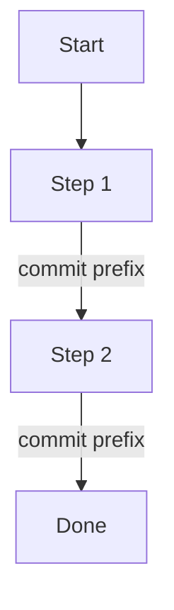

## Thinking

Begin every grilling-phase response with the keyword `ultrathink`. Scope: question-generation, codebase exploration, decision-tree walk, plan drafting. Drop the keyword once the user approves the plan — file-writing and `.gitignore` edits are mechanical.

## Workflow

```
grill user → draft plan + diagram → user iterates → user approves → write file(s) → session ends
```

1. Grill the user on goal, context, scope, and test plan — one question at a time
2. Recommend an answer to each question; explore codebase rather than guess where possible
3. Walk the decision tree: resolve dependencies between decisions before moving on
4. When all questions are resolved, draft the plan (with mermaid diagram) and show it to the user
5. Iterate until user approves
6. Write to `plans/YYYY-MM-DD-PLAN.md`
7. Render the diagram to `plans/YYYY-MM-DD-PLAN.png` with `mmdc` (skip if `mmdc` is absent)
8. If plan is complex (>7 steps OR has parallel branches), also write `plans/YYYY-MM-DD-PLAN.html` with the diagram as inline SVG via `mmdc`
9. Add `plans/` to `.gitignore` if not already present. If this changed `.gitignore`, commit that one file with `chore: ignore plans directory` and push it. Do NOT commit the plan files; they stay ignored.
10. Stop. Do NOT execute the plan.

## Grilling Rules

Ask one question at a time. Each question follows the grill-me pattern:
- Provide a recommended answer
- Surface tradeoffs the user should weigh
- If the answer is discoverable from the codebase, explore the codebase first

### Scope Challenge (mandatory)

Every grill includes a scope-challenge pass — no skip. For each proposed piece of the plan, probe whether it needs to exist now or is speculative:
- Does this piece solve a problem the user has today, or one they imagine they might have?
- Can the plan ship without it and add it later when the need is real?

Before drafting, name what is explicitly NOT being built — the deferred and rejected scope. This makes the cut visible and keeps the plan honest about its boundaries. A plan that builds everything proposed has not been challenged.

Stop grilling when:
- Goal, context, every step, every commit boundary, and every test-plan item are pinned down
- User says "enough questions, draft the plan"

## Plan Structure

````markdown
# <Short Title>

**Date**: YYYY-MM-DD
**Goal**: <one sentence — what success looks like>

## Diagram



## Context

<2-4 sentences: why this, why now, what motivated it>

## Steps

1. **<step name>** — <one-line description>
   - Commit: `<prefix>: <short phrase>`
2. **<step name>** — <one-line description>
   - Commit: `<prefix>: <short phrase>`
...

## Test Plan

- [ ] <verifiable check>
- [ ] <verifiable check>
````

Rules:
- Diagram goes directly after Goal, before Context
- Each step in the diagram is labeled with its commit prefix on the edge
- Parallel work uses parallel mermaid branches
- Each step declares its commit message in the format from `nish-ai-github`
- Steps in the body match the diagram exactly

## ROS2 Plans

When the plan targets ROS2, load `nish-ai-ros2` and fold its architectural decisions into the structure: node split (single responsibility per node, logic separated from comms), custom interfaces in their own `_msgs` packages, and the services-vs-actions choice (services <1s, actions for slow/cancellable/multi-error). These shape the steps and diagram before implementation starts.

## Diagram Rules (Markdown)

Mermaid is required and always embedded in the .md. Keep it plain — no `classDef`, no color styling, no theme directives. Edge labels carry the commit prefix.

Color-coding lives in the HTML companion only.

GitHub and most editors render the embedded mermaid natively, so the raw block is the source of truth — never replace it with an image.

## Diagram Rendering (mmdc)

The Mermaid CLI (`mmdc`) is available for turning mermaid source into static images. Use it for two outputs:

| Output | When | Command |
|--------|------|---------|
| `plans/YYYY-MM-DD-PLAN.png` sidecar | Always, alongside the `.md` | `mmdc -i diagram.mmd -o plans/YYYY-MM-DD-PLAN.png` |
| Inline SVG in the HTML companion | Per the HTML Companion rules | see that section |

The PNG sidecar helps viewers that do not render mermaid (PDF export, chat, non-GitHub previews). The `.md` mermaid block stays the source of truth; the PNG is a generated artifact.

Fallback: if `mmdc` is absent from `PATH`, skip the PNG and tell the user rendering was skipped. The plan `.md` is still complete on its own. Install via nish-setup (`brew install mermaid-cli`).

## HTML Companion

Generate `plans/YYYY-MM-DD-PLAN.html` only when:
- Plan has more than 7 steps, OR
- Plan has parallel branches (mermaid `&` or multiple paths)

HTML structure:
- Standalone, single file, fully self-contained — no external assets, no network
- Embeds the diagram as inline SVG rendered by the Mermaid CLI (`mmdc`), with color-coding baked in
- Shows plan title, goal, context, steps, test plan below the diagram

Render with `mmdc` instead of loading mermaid.js from a CDN, so the companion opens offline and never drifts when the CDN version changes:

```
mmdc -i plans/YYYY-MM-DD-PLAN.mmd -o diagram.svg -c mermaid-config.json
```

Write the diagram source to a temporary `.mmd` (the color-coded variant — `classDef` per commit prefix is allowed here, unlike the plain `.md` diagram), render to SVG, then inline the SVG into the `.html` and drop the temp files. Color map is the table below.

Fallback: if `mmdc` is not on `PATH`, emit the prior CDN-based HTML (mermaid.js via CDN) and note the degraded mode to the user. `mmdc` ships via nish-setup (`brew install mermaid-cli`).

Color-code by commit prefix:

| Prefix | Color |
|--------|-------|
| `init` | gold |
| `feat` | green |
| `fix` | red |
| `refactor` | blue |
| `docs` | purple |
| `chore` | gray |

If plan is simple (≤7 steps, linear), do NOT generate HTML. Mermaid in the .md is sufficient.

## Location

Plans live at `plans/YYYY-MM-DD-PLAN.md` from the repo root.

If `plans/` is not in `.gitignore`, add it, then commit only the `.gitignore` with `chore: ignore plans directory`. Committing the rule closes the loop — a later session inherits a clean working tree instead of an unstaged `.gitignore` edit. Plans themselves are working artifacts, not committed history.

If more than one plan is written on the same day, append a slug:
`plans/YYYY-MM-DD-PLAN-<slug>.md` (e.g. `2026-05-28-PLAN-auth-rewrite.md`)
Same slug applies to the .html companion when generated.

## Lifetime

One-shot. Fires once per session when dispatched by the router. Session ends after the plan file is written. Execution is a separate session (will dispatch to `nish-ai-goal-oriented-coding` or another category based on the plan).

## Output Style (Recency Anchor)

This section sits last on purpose: after dispatch it is the freshest part of the skill body, so task voice cannot displace house style. Every user-facing line this session — chat replies, explanations, and one-line tool preambles ("let me check…", "reading X…") — follows `nish-ai-writing-style` TERMINAL mode: no a/an/the, fragments over full sentences, self-check each line before sending. Committed prose (docs/README/comments/commit messages) uses DOCS mode instead.
