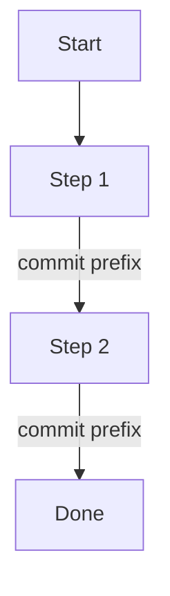

## Workflow

```
grill user → draft plan + diagram → user iterates → user approves → write file(s) → session ends
```

1. Grill the user on goal, context, scope, and test plan — one question at a time
2. Recommend an answer to each question; explore codebase rather than guess where possible
3. Walk the decision tree: resolve dependencies between decisions before moving on
4. When all questions are resolved, draft the plan (with mermaid diagram) and show it to the user
5. Iterate until user approves
6. Write to `plans/YYYY-MM-DD-PLAN.md`
7. If plan is complex (>7 steps OR has parallel branches), also write `plans/YYYY-MM-DD-PLAN.html`
8. Add `plans/` to `.gitignore` if not already present
9. Stop. Do NOT execute the plan.

## Grilling Rules

Ask one question at a time. Each question follows the grill-me pattern:
- Provide a recommended answer
- Surface tradeoffs the user should weigh
- If the answer is discoverable from the codebase, explore the codebase first

Stop grilling when:
- Goal, context, every step, every commit boundary, and every test-plan item are pinned down
- User says "enough questions, draft the plan"

## Plan Structure

````markdown
# <Short Title>

**Date**: YYYY-MM-DD
**Goal**: <one sentence — what success looks like>

## Diagram



## Context

<2-4 sentences: why this, why now, what motivated it>

## Steps

1. **<step name>** — <one-line description>
   - Commit: `<prefix>: <short phrase>`
2. **<step name>** — <one-line description>
   - Commit: `<prefix>: <short phrase>`
...

## Test Plan

- [ ] <verifiable check>
- [ ] <verifiable check>
````

Rules:
- Diagram goes directly after Goal, before Context
- Each step in the diagram is labeled with its commit prefix on the edge
- Parallel work uses parallel mermaid branches
- Each step declares its commit message in the format from `nish-ai-github`
- Steps in the body match the diagram exactly

## Diagram Rules (Markdown)

Mermaid is required and always embedded in the .md. Keep it plain — no `classDef`, no color styling, no theme directives. Edge labels carry the commit prefix.

Color-coding lives in the HTML companion only.

## HTML Companion

Generate `plans/YYYY-MM-DD-PLAN.html` only when:
- Plan has more than 7 steps, OR
- Plan has parallel branches (mermaid `&` or multiple paths)

HTML structure:
- Standalone, single file, no external assets except mermaid.js via CDN
- Renders the same mermaid diagram with color-coding applied via CSS
- Shows plan title, goal, context, steps, test plan below the diagram

Color-code by commit prefix:

| Prefix | Color |
|--------|-------|
| `init` | gold |
| `feat` | green |
| `fix` | red |
| `refactor` | blue |
| `docs` | purple |
| `chore` | gray |

If plan is simple (≤7 steps, linear), do NOT generate HTML. Mermaid in the .md is sufficient.

## Location

Plans live at `plans/YYYY-MM-DD-PLAN.md` from the repo root.

If `plans/` is not in `.gitignore`, add it. Plans are working artifacts, not committed history.

If more than one plan is written on the same day, append a slug:
`plans/YYYY-MM-DD-PLAN-<slug>.md` (e.g. `2026-05-28-PLAN-auth-rewrite.md`)
Same slug applies to the .html companion when generated.

## Lifetime

One-shot. Fires once per session when dispatched by the router. Session ends after the plan file is written. Execution is a separate session (will dispatch to `nish-ai-goal-oriented-coding` or another category based on the plan).
